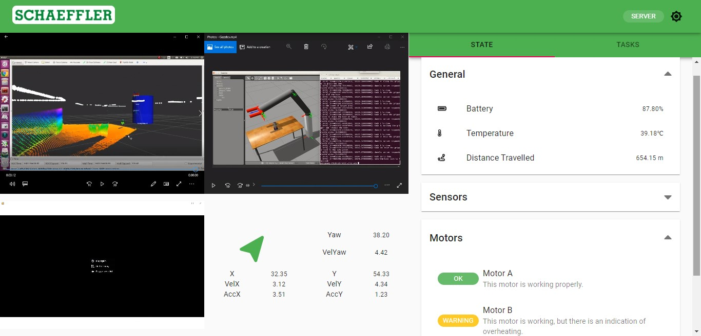

## AMR Web GUI

Web-based graphical user interface for the AMR. This project consists of a Web Socket server and a React client.



### Project Structure

This repository consists of 2 node projects.

- `amr-web-app` is the web app
- `amr-ws-express` is an ExpressJS WebSocket server.

### Running the Project

You can run either the server or the web app first.

#### Running the App

1. Open up a terminal and navigate to `amr-web-app` folder.
2. Install the required dependencies by running the command

```
npm install
```

3. Run the web application by running the command

```
npm start
```

4. If the previous command does not open a browser tab for you, open a web browser and navigate to http://localhost:3000

#### Running the Server

1. Open up a terminal and navigate to `amr-web-express` folder.
2. Install the required dependencies by running the command

```
npm install
```

3. Run the web application by running the command

```
node server
```

4. Open a browser tab, and go to http://localhost:5500 to open the broadcaster
5. You will be prompted to share the screen 3 times, choose the RVIZ screen, the Gazebo screen, and then the camera feed screen.
